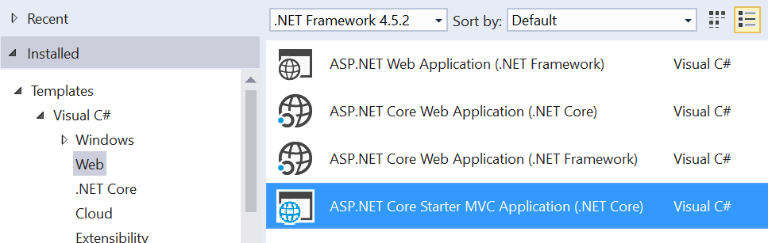

# ASP.NET Core Template Pack

Download this extension from the [VS Gallery](https://visualstudiogallery.msdn.microsoft.com/31a3eab5-e62b-4030-9226-b5e4c9e1ffb5)
or get the [CI build](http://vsixgallery.com/extension/ae9d6285-3f2a-4cbe-9021-82eb4d8b8c74/).

---------------------------------------

A collection of .NET Core project templates. Requires
[.NET Core Tooling Preview 2](https://www.microsoft.com/net/download#tools)
or later.

See the [changelog](CHANGELOG.md) for changes and roadmap.

## Templates

- Basic ASP.NET Core
- and more to come...

### Basic ASP.NET Core
This template is conceptually somewhere between the current _Empty_ and
_Web Application_ templates. It is great for learning about ASP.NET Core
as well as a clean starting point for creating any type of web application
including SPA.

It doesn't include any client-side libraries or tooling, so there is no
Bower, npm, Gulp or Bundler.

## Contribute
Check out the [contribution guidelines](.github/CONTRIBUTING.md)
if you want to contribute to this project.

For cloning and building this project yourself, make sure
to install the
[Extensibility Tools 2015](https://visualstudiogallery.msdn.microsoft.com/ab39a092-1343-46e2-b0f1-6a3f91155aa6)
extension for Visual Studio which enables some features
used by this project.

## License
[Apache 2.0](LICENSE)